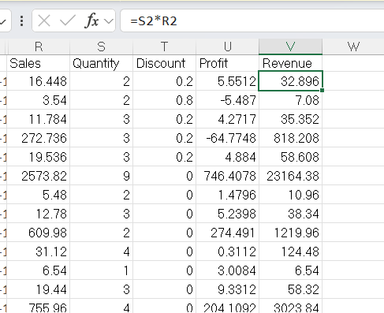
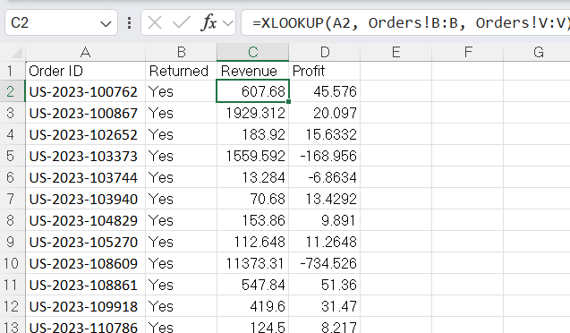
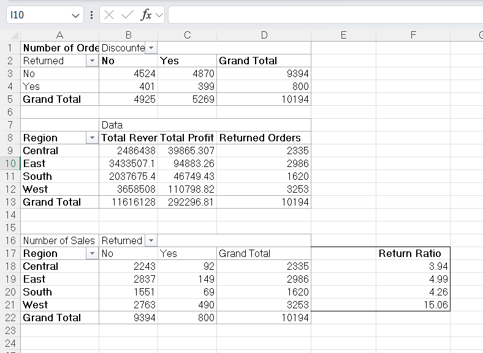

# excel-retail-sales-dashboard
Retail sales analysis using Excel pivot tables, VLOOKUP, and dashboard visualization.

## Step 1 – Inspect Dataset
- Opened the dataset and reviewed columns such as Order ID, Product Name, Category, Region, Sales, Quantity, Profit.
- Checked data types for correctness (dates, numbers, text).  

## Step 2 – Data Cleaning
**Remove duplicates:**  
- Used the built-in function Remove Duplicates (often found in Data → Data Tools) to remove repeated rows.
- scs

**Check for missing values:**  
- Filtered each column to find blanks with Data -> Filter (if there are blanks, it is possible to filter columns that contain it)  
- Filled missing numerical values with the arithmetic mean
- Filled missing categorical values with the mode
- -scs

**Add Revenue column:**  
- Formula used: `=Quantity * Sales`  
- Screenshot:  

## Step 3 – Lookup / Merge Data

- Used XLOOKUP to merge return status information from the Returns table into the main Orders dataset
- Matched records using Order ID as the unique identifier
- Created a new **Returned** column indicating whether each order had been returned
- This enriched dataset enabled analysis of return patterns and their impact on revenue and profit

Screenshot:

## Step 4 – Pivot Tables

### Pivot Table 1: Revenue and Profit by Region

* Rows: Region
* Values:

  * Sum of Revenue
  * Sum of Profit
* Purpose: Compare regional sales performance and profitability.

### Pivot Table 2: Return Analysis by Region

* Rows: Region
* Columns: Returned (Yes/No)
* Values: Count of Orders
* Purpose: Compare return activity across regions.

### Pivot Table 3: Return Rate by Region

* Calculated return ratio using:

`Return Rate = Returned Orders / Total Orders × 100`

* Purpose: Compare return rates rather than absolute return counts.

Key Findings:

* West recorded the highest return rate (15.06%)
* East, Central, and South showed similar return rates between approximately 4% and 5%
* The West region may require further investigation to identify factors contributing to higher return activity

Screenshot:

---

## Step 5 – Key Insights

* West generated the highest revenue among all regions
* West also recorded the highest profit
* Revenue demonstrated seasonal variation throughout the year
* The West region exhibited a return rate of 15.06%, substantially higher than all other regions
* High sales volume alone does not fully explain return activity, suggesting additional operational or customer-related factors may influence returns

